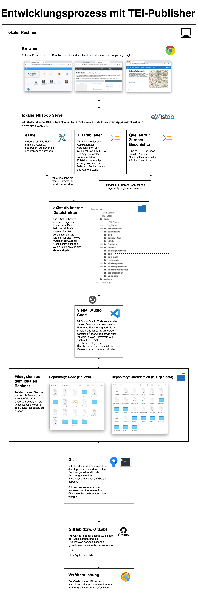

# Arbeiten mit TEI Publisher: GIT Workflow (2)

## Übersicht

(Für eine vergrösserte Ansicht: siehe separate Datei)


Auf die einzelnen Abschnitte in dieser Übersicht wird in diesem Dokument eingegangen.

Hinweis: Das Projekt „Rechtsquellen des Kantons Zürich“ besteht aus zwei Repositories: Ein Repository mit dem gesamten Quellcode und ein separates Repository, welches nur die Quelldateien enthält. Die Setup-Schritte müssen jeweils für beide Repositories einmalig ausgeführt werden.


## Schritt 1: Lokale Installation der eXist-DB und des TEI-Publishers (einmalig)

### Installationsanleitung

Hier befindet sich eine Installationsanleitung für die eXist-DB und den TEI-Publisher: [https://teipublisher.com/exist/apps/tei-publisher/doc/documentation.xml?id=installation](https://teipublisher.com/exist/apps/tei-publisher/doc/documentation.xml?id=installation)

Es gibt zwei Wege, die Applikation zu installieren: entweder über Docker oder als Standalone Java Applikation. 

Die Docker-Version hat einen eher instabilen Eindruck gemacht, deshalb ist die Installation als Standalone Java Applikation empfohlen.

**Hinweis**: da TEI-Publisher Root-Rechte erfordert, kann er nicht auf dem Arbeitsrechner installiert werden.

### Verwendete Java-Version

Es gibt verschiedene Versionen der Java Runtime. Falls auf dem System Java noch nicht installiert ist, kann zum Beispiel die folgende Runtime verwendet werden: [https://www.java.com/de/download/manual.jsp](https://www.java.com/de/download/manual.jsp)

### Installation von benötigen Hilfs-Packages

Nach der Installation kann der eXist-Datenbank-Server gestartet werden und das Dashboard geöffnet werden:


Standartmässig ist bereits ein Benutzer angelegt, mit dem man sich einloggen kann:

- Username: `admin`
- Passwort: (leer)

Anschliessend können über den Package Manager weitere Applikationen für die eXist-DB nachinstalliert werden:


Anscheinend gibt es momentan einen Bug, der verhindert, dass der TEI-Publisher seine Abhängigkeiten selbst lädt. Bei der Installation der Applikation „TEI Publisher“ kann es deshalb zu einem Fehler kommen. 

Um den Fehler zu beheben, sollten zuerst zwei benötigte Abhängigkeiten installiert werden:


Anschliessend kann auch der TEI Publisher installiert werden:


### User-Management

Im Abschnitt User-Management kann man weitere User-Accounts und Passwörter anlegen:


## Schritt 2: Installation von Hilfstools: Ant, Node, npm (einmalig)

### Ant

- ANT wird benötigt, um später aus dem Quellcode der Applikation eine `.xar`-Datei zu erzeugen: [https://ant.apache.org/bindownload.cgi](https://ant.apache.org/bindownload.cgi)

### Node und npm

- Node und Npm werden benötigt, um später mittels Visual Studio Code automatisch die Änderungen an den Codedateien zur Exist-Datenbank zu Synchronisieren.
- Je nach Betriebssystem funktioniert die Installation unterschiedlich. Eine Anleitung befindet sich hier: [https://docs.npmjs.com/downloading-and-installing-node-js-and-npm](https://docs.npmjs.com/downloading-and-installing-node-js-and-npm)


## Schritt 3: Anlegen eines GitLab Accounts (einmalig)

### Anlegen eines Accounts (kostenlos)
[https://gitlab.com](https://gitlab.com)

### Beitritt zur Gruppe „Quellen zur Zürcher Geschichte“
Zur Gruppe „Quellen zur Zuercher Geschichte“ hinzugefügt werden. (Nur bestehende Mitglieder:innen in der Gruppe mit den Rollen „Maintainer“ oder „Owner“ können neue Mitglieder:innen hinzufügen)


### Applikationstoken erstellen
Ein Token wird benötigt, damit man später Git mit einer Dritt-Applikation ansteuern kann (zum Beispiel SourceTree, siehe unten)


Nach dem Generieren des Tokens wird das Token auf der Benutzeroberfläche angezeigt. Das Token dient später als Passwort für Sourcetree und sollte zwischengespeichert werden um es später zu verwenden.


## Schritt 4: GitLab Zugangsdaten zum Git-Client hinzufügen (einmalig)

Wenn ein grafischer Git-Client wie Sourcetree verwendet wird, können die Zugangsdaten zu GitLab in den Einstellungen hinterlegt werden:


Hinweis: Als Passwort wird das zuvor generierte Token eingegeben, und nicht das Passwort, dass bei der Registrierung für GitLab gewählt wurde.


## Schritt 5: Beide Projekt-Repositories von GitLab klonen (einmalig)

### Variante 1: Über die Konsole klonen

```bash
git clone https://gitlab.com/quellen-zur-zuercher-geschichte/quellen-zur-zuercher-geschichte.git
```

```bash
git clone https://gitlab.com/quellen-zur-zuercher-geschichte/quellen-zur-zuercher-geschichte-daten.git
```

### Variante 2: Über einen Git-Client klonen

Statt die Git-Konsole zu verwenden, kann auch ein grafischer Git-Client (zum Beispiel SourceTree) verwendet werden: 


## Schritt 6: Applikation zur Exist-DB hinzufügen (einmalig)

Später wird der geklonte Quellcode automatisch mit der ExistDB synchronisiert. Damit dies funktioniert, muss jedoch bereits eine initiale Version des Codes zur Exist-DB hinzugefügt werden.

Dazu muss zuerst aus den geklonten Repositories jeweils eine `.xar`-Datei erzeugt werden. Dies geschieht über die Konsole, die lokalen Pfade müssen je nach Speicherort des Codes abgeändert werden:

```bash
cd /Users/jan/quellen-zur-zuercher-geschichte

ant
```

Dieser Befehl erzeugt die `.xar`-Datei. Der Speicherort der `.xar`-Datei wird auf der Konsole ausgegeben:

```bash
/Users/jan/quellen-zur-zuercher-geschichte/build/qzh-0.1.xar
```

Die gleichen Schritte sollten auch für das Daten-Repository durchgeführt werden:

```bash
cd /Users/jan/quellen-zur-zuercher-geschichte-daten

ant
```

auch hier wird wieder der Speicherort auf der Konsole ausgegeben:

```bash
/Users/jan/quellen-zur-zuercher-geschichte-daten/build/qzh-data-0.1.xar
```

Als nächstes sollen die beiden `.xar`-Files zur Exist-DB hinzugefügt werden. Dazu öffnet man das Dashboard der Exist-DB und meldet sich mit dem Nutzer `admin` an. Das Passwort kann leer gelassen werden:


Als nächstes wechselt man zum Package Manager:


Nun können die beiden `.xar`-Files per Drag-and-Drop zum Package Manager hinzugefügt werden:


Wenn die Installation funktioniert hat, erscheinen nun beim Launcher der Exist-DB zwei neue Icons für „Quellen zur Zürcher Geschichte“ und „Quellen zur Zürcher Geschichte: Daten“. Wenn man auf das Icon „Quelle zur Zürcher Geschichte“ klickt, sollte die Applikation gestartet und angezeigt werden:


## Schritt 7: Visual Studio Code und Erweiterungen installieren (einmalig)

Hinweis: Statt mit Visual Studio Code kann auch direkt mit dem eXide-Editor gearbeitet werden. Dies hat jedoch den Nachteil, dass jede Änderung im Code wieder auf das File-System exportiert und manuell in das Git-Repository kopiert werden muss, was umständlich und fehleranfällig ist. Deshalb wird hier nur auf die Variante mit Visual Studio Code eingegangen.

Für die Arbeit mit Visual Studio Code sollte die Erweiterung **existdb-vscode** installiert werden (im Menü unter `Code > Einstellungen > Erweiterungen`):


Daneben soll auch die Erweiterung `tei-publisher-vscode` installiert werden:


Diese beiden Erweiterungen vereinfachen das Bearbeiten der Dateien und kümmern sich darum, dass Änderungen an den Codedateien automatisch mit der eXist-DB synchronisiert werden. 

## Schritt 8: Automatische Synchronisation mit der eXist-DB einrichten (einmalig)

Das Synchronisieren muss zuerst konfiguriert werden. Dies muss nacheinander für beide Repositories gemacht werden.

Dazu öffnet man ein Repository über das Menü `Datei > Öffnen`


Anschliessend drückt man in Visual Studio Code `Ctrl+Shift+P`, um alle Commands anzuzeigen (`CMD-Shift-P` auf dem Mac).

Im sich öffnenden Dialog wählt man die Option `eXist-db: Create or edit configuration for folder`. Anschliessend wählt man das angezeigte Verzeichnis mit dem Code aus:


Es öffnet sich eine Datei, in der die Synchronisation konfiguriert werden kann. In dieser Datei sollte man den Zielpfad anpassen, der angibt, in welches Verzeichnis innerhalb des TEI-Publishers der Sourcecode aus Visual Studio Code kopiert werden soll.

Hier heisst das Ziel-Verzeichnis: `/db/apps/qzh`:

```json
{
    "servers": {
        "localhost": {
            "server": "http://localhost:8080/exist",
            "user": "admin",
            "password": "",
            "root": "/db/apps/qzh" <- hier den pfad anpassen
        }
    },
    "sync": {
        "server": "localhost",
        "ignore": [
            ".existdb.json",
            ".git/**",
            "node_modules/**",
            "bower_components/**",
            "package*.json",
            ".vscode/**"
        ]
    }
}
```

Für das zweite Repository sollten die gleichen Schritte wiederholt werden. Allerdings sollte man hier einen anderen Zielpfad wählen (z.B. `/db/apps/qzh-data`)


## Schritt 9: Automatische Synchronisation mit eXist-DB starten (nach jedem Neustart von Visual Studio Code)

**Wichtig**: Dieser Schritt sollte immer als erstes gemacht werden, bevor man Änderungen am Code durchführt oder die neusten Änderungen des Codes von GitLab pullt.

Auch hier sollen die folgenden Schritte für beide Repositories wiederholt werden. Innerhalb von Visual Studio Code klickt man wieder auf  `Ctrl+Shift+P`, um alle Commands anzuzeigen (`CMD-Shift-P` auf dem Mac). Über das angezeigte Menü wählt man diesmal `eXist-db: Control folder synchronisation to database`


Anschliessend wählt man `start synchronization`:


Wenn alles Funktioniert hat, sieht man jeweils beim Speichern einer Datei, wie die Änderung an die Exist-DB übertragen wird:


Hinweis: Nicht-gesicherte Dateien werden nicht automatisch übertragen. Bei ungültigen Änderungen wird jeweils eine Fehlermeldung angezeigt und die Änderungen nicht übertragen:


## Schritt 10: Automatisches Browser-Update einrichten (nach jedem Neustart der Exist-DB)

Die in Visual Studio Code vorgenommenen Änderungen sollten direkt im Browser angezeigt werden.  Dazu öffnet man zuerst die Exist-DB:


Anschliessend wechselt man in eXide. Wenn alles funktioniert hat, sieht man dort die synchronisierten Dateien (unter „directory“):


Vorsicht: Der Sync funktioniert nur in eine Richtung. Änderungen innerhalb von eXide werden nicht an Visual Studio und das Filesystem zurückgespiegelt! Die Änderungen sollten deshalb nur in Visual Studio Code vorgenommen werden.

Als nächstes aktiviert man im Menü von eXide die Option „Live Reload“:


Die Applikation zeigt nun einen Link an, der mit einem Klick geöffnet werden kann:


Im Browser öffnet sich nun die Applikation:


Nach einer Änderung an den Dateien über Visual Studio Code kann einfach die Browser-Seite neu geladen werden, um die Änderungen live anzuzeigen.


**Hinweis**: Es kann sein, dass gewisse Änderungen nicht sofort sichtbar sind, weil sie vom Browser ge-cached wurden. In diesem Fall sollte der Cache des Browsers gelöscht werden oder der „Inkognito-Modus“ des Browsers verwendet werden.

## Schritt 11: Änderungen in das GIT-Repository pushen (regelmässig)

Änderungen an den Codedateien können entweder über die Konsole oder über einen grafischen GIT-Client wie SourceTree auf GitLab gepusht werden.

Bei SourceTree wählt man über die Checkbox sämtliche Änderungen aus, die man „committen“ möchte und klickt anschliessend unten rechts auf „Commit“. Um die Änderungen schlussendlich auf GitLab zu laden, klickt man auf den Button „Push“.


## Schritt 12: Änderungen vom GIT-Repository pullen (regelmässig)

**Wichtig**: Neue Änderungen sollten erst dann vom Repository gepullt werden, wenn die automatische Synchronisierung zwischen Filesystem und der Exist-DB läuft (Schritt 9)

Wenn gemeinsam am Code gearbeitet wird, kann es sein, dass es auf GitLab bereits Änderungen durch andere Personen gegeben hat. In diesem Fall sollte man den neuen Source Code „pullen“ bevor man seine Änderungen pusht. Dazu gibt es im SourceTree den Button „Pull“ (bei vorhandenen Änderungen ist dieser jeweils mit einer Zahl hervorgehoben). Falls zwei Personen die gleiche Datei bearbeitet haben, kann es zu GIT-Konflikten kommen, die anschliessend wieder aufgelöst werden müssen.

## Weitere Ressourcen

[https://www.youtube.com/watch?v=dyY539HzN6Q](https://www.youtube.com/watch?v=dyY539HzN6Q)

In diesem Video werden zwei mögliche Workflows vorgestellt: „Database as Master“ und „Git as Master“. In diesem Dokument ist nur die Version „Git as Master“ beschrieben.

Das Video enthält auch eine grundlegende Einführung zum Thema GIT.