# Arbeiten mit TEI Publisher:  Theorie (1)

##  Hinweis

Das folgende Dokument soll einen groben Überblick zur Entwicklung mit TEI-Publisher geben. Es handelt sich nicht um eine umfassende Einführung in die einzelnen Technologien. Im Dokument verlinkt sind jeweils weiterführende Ressourcen.

## Links: Einarbeitung

- Einführung / Zweck: [https://digitalintellectuals.hypotheses.org/3912](https://digitalintellectuals.hypotheses.org/3912)
- Bereits realisierte Apps: [https://sources-online.org/](https://sources-online.org/)
- Workshop: [https://www.youtube.com/watch?v=QuWrfAS2SWM](https://www.youtube.com/watch?v=QuWrfAS2SWM)
- Workshop Unterlagen: [https://github.com/eeditiones/workshop](https://github.com/eeditiones/workshop)
- Demo-Instanz [http://apps5test.existsolutions.com](http://apps5test.existsolutions.com)
	- Username: `tei`
	- Password: `simple`
	- Username: `tei-demo`
	- Password: `demo`
- Slack: [https://e-editiones.slack.com](https://e-editiones.slack.com)
- Einsatz des TEI Publishers am Beispiel der Alfred Escher Edition: [https://www.youtube.com/watch?v=ZxdeVkwT0DY](https://www.youtube.com/watch?v=ZxdeVkwT0DY)
- „Getting started with app development in eXist-db 2.0: [https://www.youtube.com/watch?v=ZxdeVkwT0DY](https://www.youtube.com/watch?v=ZxdeVkwT0DY) (bezieht sich auf eine ältere Version der eXist-db, der Aufbau ist jedoch fast identisch)
- Praxisbeispiel: Eine bestehende TEI-Publisher Applikation anpassen: [https://www.youtube.com/watch?v=HxCo303tgOk](https://www.youtube.com/watch?v=HxCo303tgOk)
- Übersicht mit weiteren hilfreichen Ressourcen: [https://digitale-akademie.adw-goe.de/enzyklopaedie/xml-and-tei-publisher-helpful-literature-and-websites/](https://digitale-akademie.adw-goe.de/enzyklopaedie/xml-and-tei-publisher-helpful-literature-and-websites/)

## Offizielle Dokumentationen

### TEI Publisher
- [http://apps5test.existsolutions.com/exist/apps/tei-publisher/doc/documentation.xml](http://apps5test.existsolutions.com/exist/apps/tei-publisher/doc/documentation.xml)

- Wenn der TEI-Publisher lokal installiert wurde, kann auch die lokale Dokumentation verwendet werden: [http://localhost:8081/exist/apps/tei-publisher/doc/documentation.xml?odd=docbook.odd](http://localhost:8081/exist/apps/tei-publisher/doc/documentation.xml?odd=docbook.odd)

- In der Dokumentation gibt es auch ein FAQ-Teil mit häufig gestellten Fragen: [https://faq.teipublisher.com/odd/](https://faq.teipublisher.com/odd/)

### TEI (XML)
 - [https://www.tei-c.org/release/doc/tei-p5-doc/en/html/TD.html#TDPMPM](https://www.tei-c.org/release/doc/tei-p5-doc/en/html/TD.html)
- [https://www.ssrq-sds-fds.ch/wiki/Transkriptionsrichtlinien](https://www.ssrq-sds-fds.ch/wiki/Transkriptionsrichtlinien)

### Web Components
- Web Components sind HTML-Komponenten, die zum Entwickeln eigener TEI-Publisher Apps eingesetzt werden können. 

- Dokumentation der Web-Components (Interaktiv): [https://unpkg.com/@teipublisher/pb-components@1.38.5/dist/api.html](https://unpkg.com/@teipublisher/pb-components@1.38.5/dist/api.html)

- Hier sind nur die wichtigsten Web-Components aufgeführt und kurz beschrieben: [https://teipublisher.com/exist/apps/tei-publisher/doc/documentation.xml?id=webcomponents-docs](https://teipublisher.com/exist/apps/tei-publisher/doc/documentation.xml?id=webcomponents-docs)

### eXist-DB
- [https://exist-db.org/exist/apps/doc/documentation](https://exist-db.org/exist/apps/doc/documentation)

### eXide

- [https://github.com/eXist-db/eXide#readme](https://github.com/eXist-db/eXide#readme)
- [https://github.com/eXist-db/eXide/blob/develop/docs/docs.md](https://github.com/eXist-db/eXide/blob/develop/docs/docs.md)

## Glossar: Technologien

### TEI
Format, um die Quellen (XML-Dateien) auszuzeichnen

```xml
<!-- beispiel: auszug -->
<lb/>was für reisen er gemacht? ob und wann er zu <placeName>Bern</placeName> ge-
<lb/>taufft worden, auch obe er zu <placeName>Einsidlen</placeName> nicht um
<lb/>ein gleiches angehalten, und was ihme dorten
<lb/>widerfahren, befraget; und seine verantwortung
<lb/>widerum an <abbr>mghh.</abbr> gebracht werden.</p></div>
```

### ODD

Definiert Regeln, um eine TEI-Datei grafisch darzustellen in verschiedenen Formaten. ODD wird in einem Folgekapitel genauer beschrieben.

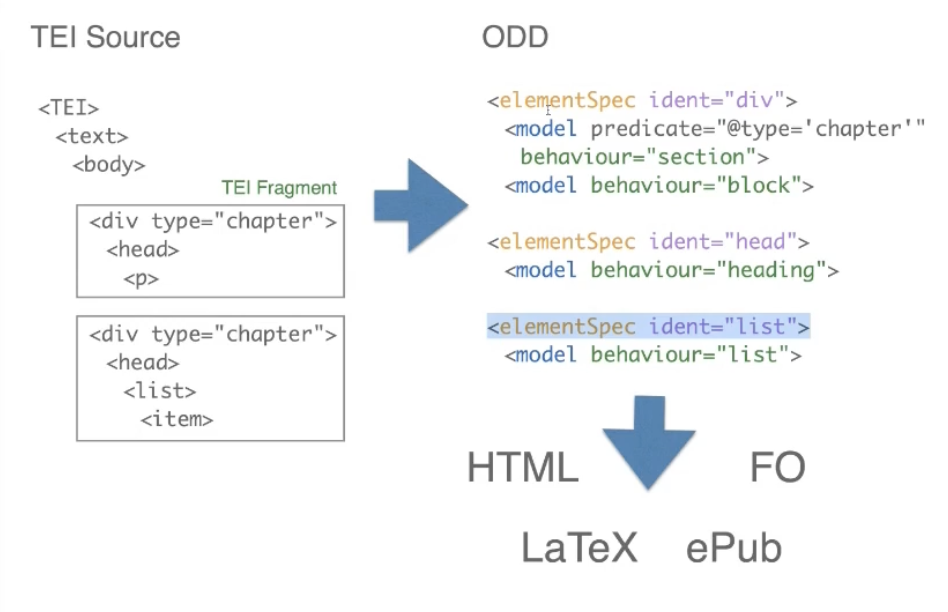

###  XPath

Mit XPath können Informationen aus einer XML-Datei extrahiert werden. 

Beispiele:
- `//child::Buch/Kapitel`: Alle Kapitel aller Bücher.
- `//child::Buch/Kapitel[1]`: Alle ersten Kapitel aller Bücher. 
- `//child::Buch[count(./Seite)<=100][count(./Seite)>=10]`: liefert alle Knoten vom Typ „Buch“, die mindestens 10 aber höchstens 100 Kinderemente vom Typ „Seite“ haben.

Beim TEI-Publisher werden XPath-Ausdrücke eingesetzt, um Informationen aus den TEI-XML-Quellenstücken zu extrahieren (zum Beispiel den Titel oder gewisse Metadaten).  Weitere Beispiele gibt es zum Beispiel unter: [https://www.freeformatter.com/xpath-tester.html#before-output](https://www.freeformatter.com/xpath-tester.html#before-output). Auf dieser Seite können auch eigene Ausdrücke getestet werden.

### XQuery

XQuery ist eine funktionale Abfragesprache für XML-Dateien. XQuery ist umfassender als XPath, allerdings ist jeder gültige XPath-Ausdruck auch ein gültiger XQuery-Ausdruck.

Mit FLWOR-Expressions können die XML-Daten ähnlich wie bei SQL abgefragt werden:

```XQuery
(: Beispiel :)
let $doc := .
for $v in $doc//video,
$a in $doc//actors/actor
where ends-with($a, 'Lisa')
and $v/actorRef = $a/@id
order by $v/year
return $v/title
```

Beim TEI-Publisher werden XQuery-Funktionen auch eingesetzt, um aus den XML-Dateien den anzuzeigenden HTML-Code zu generieren (siehe weiter unten).

Weitere Informationen zu XQuery finden sich auch hier: [https://exist-db.org/exist/apps/doc/learning-xquery](https://exist-db.org/exist/apps/doc/learning-xquery)

### eXist-db
Eine XML-Datenbank. Innerhalb der eXist-db kann man verschiedene Apps Starten: z.B. TEI Publisher, eXide und eigene Apps wie „Zürcher Rechtsquellen“ oder „Quellen zur Zürcher Geschichte“.


### TEI Publisher
Eine App innerhalb der eXist-db. Eine Toolbox zum Veröffentlichen von Quellenstücken. Mit TEI Publisher können eigene „Apps“ erzeugt werden.


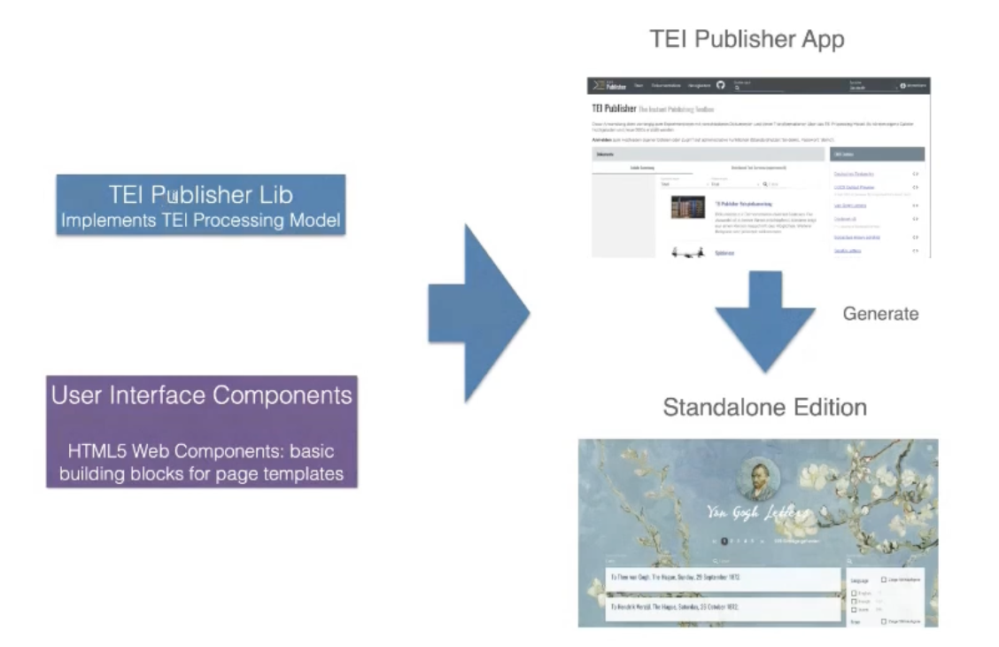

### eXide
Entwicklungsumgebung im Browser. Damit können die Apps und XML-Dateien innerhalb der eXist-db bearbeitet werden. Damit können zum Beispiel die Files des TEI Publishers editiert werden


## Beispielhafter Aufbau einer TEI-Publisher Applikation

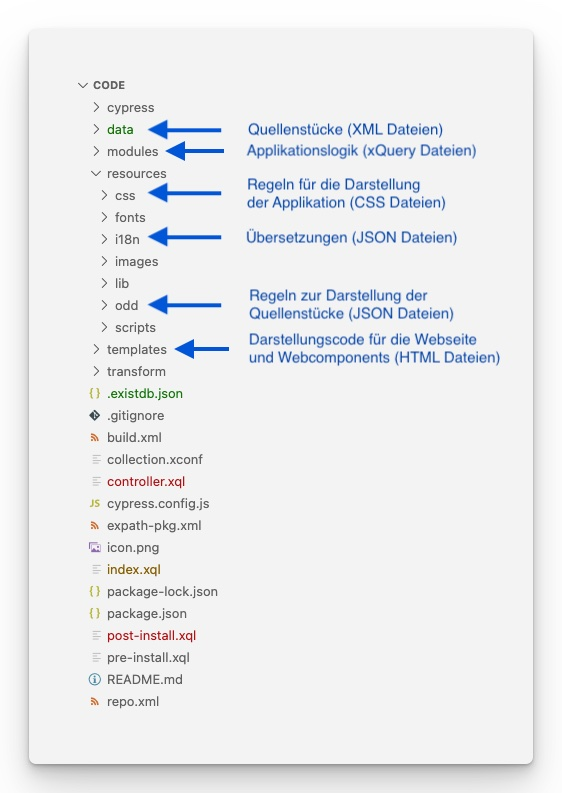

Die einzelnen Komponenten einer TEI-Publisher Applikation (TEI-XML Quelldateien, ODD-Dateien, Page-Templates) sind in den Folgekapiteln genauer beschrieben.


## Einführung: ODD

### Für was gibt es ODD?
- In den ODD-Dateien sind Regeln angegeben, wie TEI-XML Dateien dargestellt werden sollen.
- ODD-Dateien sind Format-unabhängig. Das heisst mit einer einzigen ODD-Datei kann die Darstellung eines TEI-XML für verschiedene Output-Formate (wie HTML, LaTeX, ePub etc.) definiert werden.


### ODDs Editieren

Ist man im TEI-Publisher als Administrator angemeldet, kann man ein ODD über die Weboberfläche bearbeiten:


### Grafischer Editor für ODD-Dateien 

TEI-Publisher besitzt einen grafischen Editor für die ODD-Dateien:

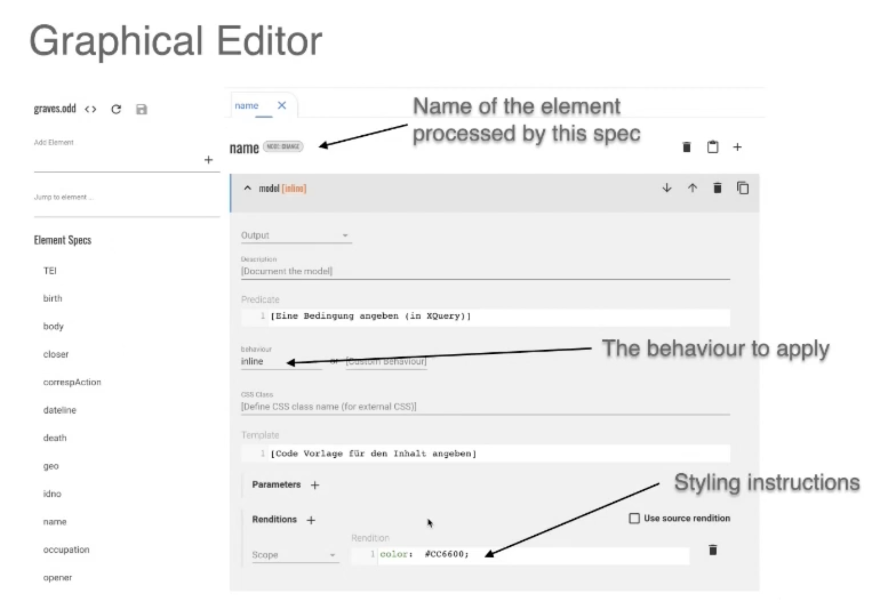

### Text-Editor für ODD-Dateien

Alternativ kann das ODD direkt als XML-Text in der eXide bearbeitet werden:

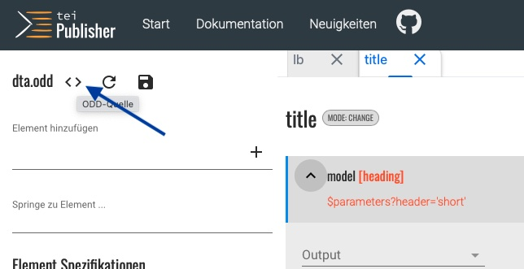

Man kann ein ODD gleichzeitig im XML Editor und im grafischen Editor geöffnet haben, man muss es aber bei jeder Änderung an einem Ort die jeweils andere Seite neu laden.

### Einfaches Beispiel: Wie sind ODD-Dateien aufgebaut?

Eine ODD-Datei besteht aus mehreren „Regeln“.

Die folgende beispielhafte Regel gibt an, dass Text, der im TEI-XML als „head“ ausgezeichnet ist, mit dem vordefinierten Stil/Behavior „heading“ dargestellt werden soll:

```xml
<elementSpec ident="head">
	<model behaviour="heading"/>
</elementSpec>
```

Dieser Schritt erscheint redundant, doch durch die Trennung von ODD und TEI-XML wird die Semantik von der Darstellung unabhängig gemacht. 

Wie ein „heading“ gerendert wird, hängt vom Ausgabeformat (HTML, LaTeX, ePub… ab). Neben „heading“ gibt es zahlreiche weitere vordefinierte „Behaviors“:

 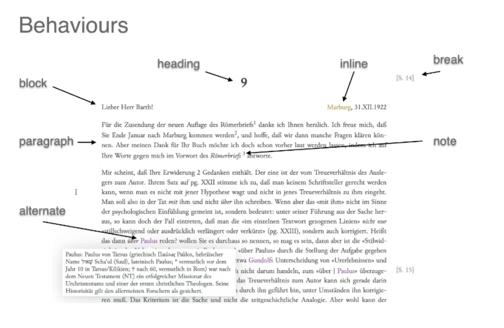


### ODD-Regeln: Predicates

Mit einem Predicate kann man weiter einschränken, auf welche Elemente innerhalb des TEI-XML-Files sich eine Regel beziehen soll.

Als Wert für ein Predicate wird ein XPath-Ausdruck erwartet. Beispiel:

```xml
<model predicate="@type='place'" behaviour-"inline">
```

### ODD-Regeln: Output Rendition

Der Output der ODD-Regel kann mit einem eigenen CSS noch weiter optisch angepasst werden. Dazu schreibt man einfach das gewünschte CSS innerhalb des `outputRendition`-tags. Im folgenden Beispiel werden alle ausgezeichneten Namen im Quellenstück orange dargestellt:

```xml
<elementSpec ident="name" mode="change">
	<model behaviour="inline">
		<outputRendition>
			color: #CC6600;
		</outputRendition>
	</model>
</elementSpec>
```

Der angegebene CSS-Code gilt jeweils isoliert für das aktuelle Element und hat keinen Einfluss auf das generelle Aussehen der Seite.

Statt die CSS-Regeln direkt in den Code zu schreiben, kann man auch eine separate CSS-Datei verlinken (wird im TEI-Publisher Workshop genauer beschrieben).

###  ODD-Regeln: Param

Einige Behaviours haben Parameter. Diese werden als Child-Elemente zum Model hinzugefügt. Zum Beispiel hat das Behaviours `heading` den Parameter `Level`:

```xml
<model behaviour="heading">
	<param name="level" value="2"/>
</model>
```

Alle Behaviours haben einen impliziten Parameter: `content`. Dies ist der Inhalt (TEI-XML), der dargestellt werden soll und an das Behaviour für das Rendering übergeben wird. Der Content-Parameter besagt also welcher Teil des Dokuments durch das Modell verarbeitet wird. Man kann diesen impliziten Parameter auch explizit überschreiben:

```xml
<elementSpec mode="change" ident="app">
	<model behaviour="heading">
		<param name="content" value="lem"/> <!-- hier wird dem heading-behaviour nicht das ganze <app> als Parameter zum Rendering mitgegeben, sondern nur der Kind-Knoten <lem>-->
	</model>
</elementSpec>
```

Der `content`-Parameter erwartet einen XPath-Ausdruck als wert, also zum Beispiel `lem` oder `persName[@type='full']`.

###  Übersicht über alle verfügbaren Behaviours und Parameter

In der Dokumentation sind alle Behaviours und dazugehörigen Parameter aufgelistet: [http://apps5test.existsolutions.com/exist/apps/tei-publisher/doc/documentation.xml?odd=docbook.odd&id=behaviours-available](http://apps5test.existsolutions.com/exist/apps/tei-publisher/doc/documentation.xml?odd=docbook.odd&id=behaviours-available)

(Leider werden die „Required Parameters“ im grafischen Editor nicht automatisch vorgeschlagen, man muss also selber in der Dokumentation überprüfen, dass man nichts vergessen hat)


### Weitere Informationen zu ODD-Dateien

In der oben verlinkten Workshop-Serie zum TEI-Publisher ([https://www.youtube.com/watch?v=QuWrfAS2SWM](https://www.youtube.com/watch?v=QuWrfAS2SWM)) werden weitere Aspekte der ODD-Dateien behandelt: Das Alternate Model, Die Verwendung von mehreren Models, Model Sequences, …

## Page Templates

### Was sind Page Templates?
Wie oben beschrieben, wird mit ODD-Dateien definiert, wie die TEI-XML-Dateien auf der Webobefläche angezeigt werden sollen. In der Regel besteht die Webseite jedoch nicht nur aus der Anzeige eines einfachen Textes sondern beinhaltet weitere Informationen: Ein Logo, ein Menü, eine Navigation, eine Tabelle mit Metadaten zum Dokument etc…

Während sich das ODD-File nur um die Darstellung des Dokuments kümmert, werden die sonstigen Elemente auf der Webseite mit `.html`-Dateien (sogenannten Page-Templates) konfiguriert:

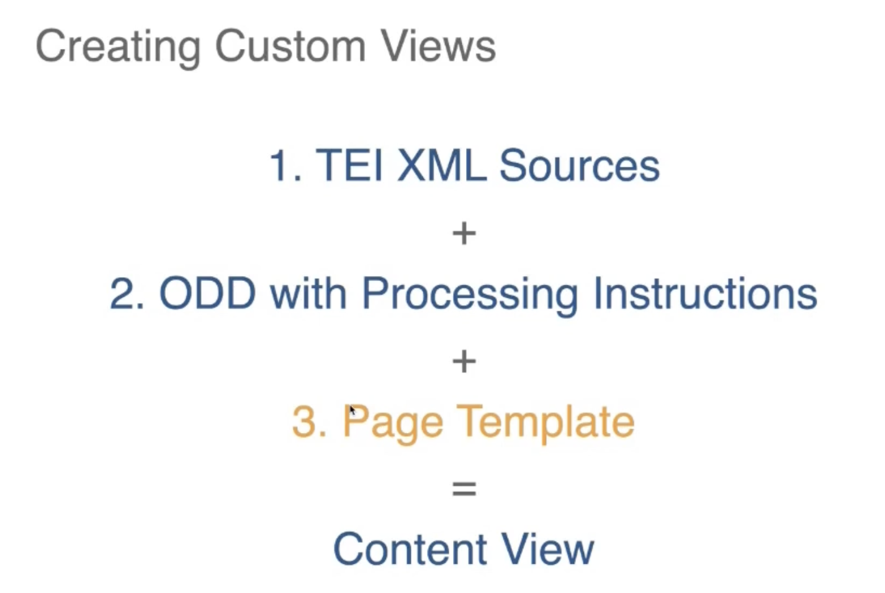

### Web Components

Zum Glück muss man nicht das ganze HTML von Grund auf selbst schreiben, denn es gibt bereits viele vordefinierte Komponenten: Web Components.

Web Components sind Elemente, die auf der Webseite dargestellt werden können und für die eigenen Bedürfnisse konfiguriert werden können. Hier sind einige Beispiele von Web Components:

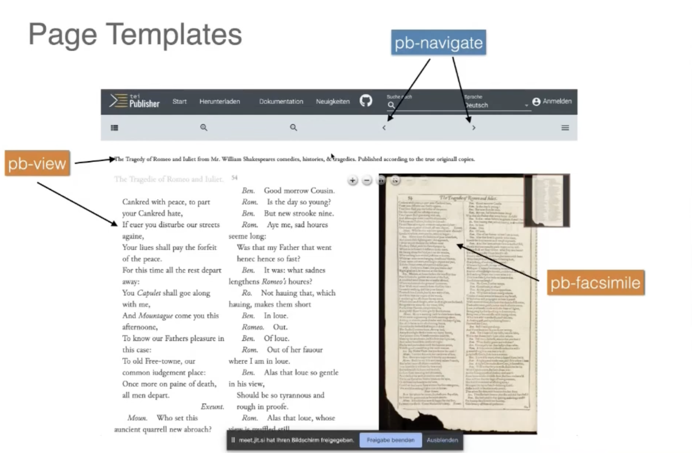
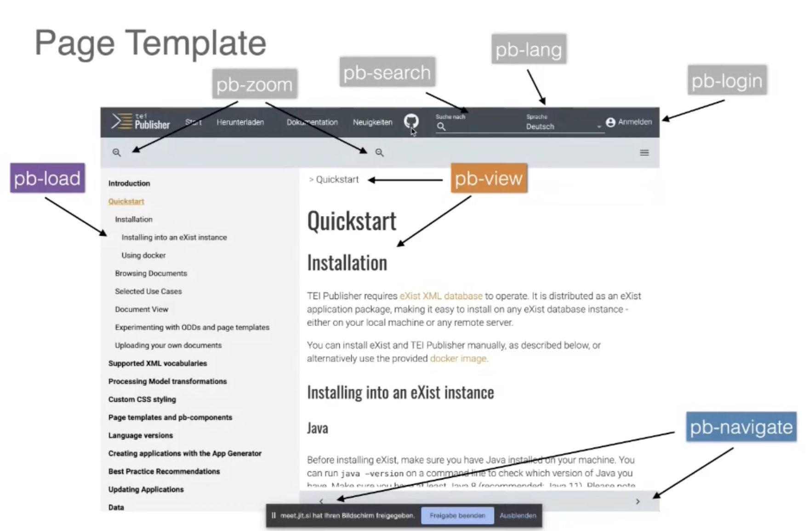

Die Webkomponente `pb-view` ist am wichtigsten. Innerhalb der `pb-view` wird das Dokument dargestellt (also das Resultat der ODD-Transformation). Daneben gibt es zahlreiche weitere Views (z.B: `pb-facsimilie` zur Darstellung von Grafiken)

Webkomponenten können wie ganz normale HTML-Tags verwendet werden. Hier ist ein Beispiel, wie Webkomponenten eingesetzt werden: 

```xml
<pb-page>
   <!-- Display two document views side by side -->
  <main>
      <pb-view id="view1" src="document1"></pb-view>
      <pb-view id="view2" src="document2"></pb-view>
  </main>
</pb-page>
```

### Weitere Details zu den Web Components:

Weitere Informationen zu den Web Components finden sich hier: [https://teipublisher.com/exist/apps/tei-publisher/doc/documentation.xml?id=webcomponents-intro](https://teipublisher.com/exist/apps/tei-publisher/doc/documentation.xml?id=webcomponents-intro)

In der oben verlinkten Workshop-Serie zum TEI-Publisher ([https://www.youtube.com/watch?v=QuWrfAS2SWM](https://www.youtube.com/watch?v=QuWrfAS2SWM)) werden weitere Aspekte der Page Templates und Webkomponenten behandelt. So wird zum Beispiel gezeigt, wie man neben eine Dokument auch ein `facimile`-View implementiert, so dass neben dem Text auch jeweils die dazugehörigen Bilder der jeweiligen Seite angezeigt werden können:

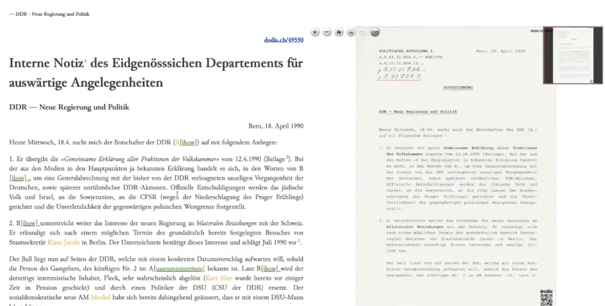

### Channels 

Damit mehrere Webkomponenten untereinander kommunizieren können, gibt es das Konzept der Channels. Gewisse Komponenten können Events in einen Channel schreiben während andere Komponenten den gleichen Channel „abonnieren“, um über Events informiert zu werden.

So kann zum Beispiel eine `pb-view` die `pb-facimile`-view darüber Informieren, dass das dazugehörige Bild für ein Quellenstück angezeigt werden soll. Im Code sieht dies dann zum Beispiel so aus:

```xml
<pb-view id="view1" src="document1" column-separator=".tei-cb" append-footnotes="append-footnotes" subscribe="transcription" emit="transcription" wait-for="#facsimile"/>
<pb-facsimile id="facsimile" base-uri="https://apps.existsolutions.com/cantaloupe/iiif/2/" default-zoom-level="0" show-navigation-control="show-navigation-control" show-navigator="show-navigator" subscribe="transcription"/>
```
(Beachte die Attribute „Subscribe“ und „Emit“):


## XQuery (.xql) - Dateien

Verwendet man nur die vordefinierten WebComponents von TEI-Publisher, so muss man in der Regel keinen `.xql`-Code schreiben (jede WebComponent hat bereits vordefinierte `.xql`-Dateien und kann über die HTML-Tags konfiguriert werden.)

Die xQuery-Dateien beinhalten die Applikationslogik. Beim TEI-Publisher werden die `.xql` Dateien in der Regel verwendet, um Informationen aus den Quellenstücken auszulesen, und diese als HTML-Code darzustellen. 

Siehe Folgekapitel: Einführung Templating Framework


## Einführung: Templating Framework

- Das Templating kümmert sich um das Zusammenspiel zwischen `.html` und `.xql`-Dateien
- Die Logik ist in .xql-Dateien implementiert, die Darstellung in .html-Dateien.
- Das Templating-Framework transformiert unser HTML für die finale Darstellung auf dem Browser.

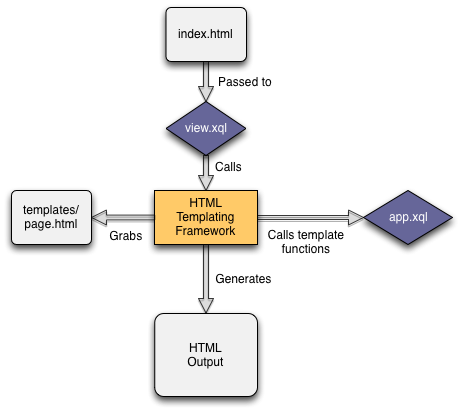

Beispiel: Im folgenden Codebeispiel ist innerhalb des `class`-Tags eine Anweisung für das Templating-Framework geschrieben:

```html
<div class="templates:surround?with=templates/page.html&amp;at=content">
	<p>(My Content)</p>
</div>
```

Das Templating-Framework wird hier angewiesen, unseren Inhalt (My Content) mit dem Inhalt aus dem File `page.html` zu ergänzen. `page.html` enthält diejenigen Elemente, die auf allen Seiten angezeigt werden sollen (zum Beispiel das Menü, das Icon, den Footer etc. ) So wird verhindert, dass für jede neue Seite dieser Code dupliziert werden muss.

Das Templating-Framework ist auch dafür zuständig, den XQL-Code (Applikationslogik) auszuführen, wenn die .html-Seite aufgerufen wird.  So ruft zum Beispiel der HTML-Code `<div class="demo:hello" data-template-customparameter="123"></p>` die Funktion `demo:hello ` im File `demo.xql` auf:

```XQuery
declare function demo:hello($node as node(), $model as map(*), $customparameter as xs:string?) {
    <p>Hello (...)!</p> (: hier könnte zum Beispiel der Name aus einem XML-Quellenstück ausgelesen werden :)  
};
```

> A template function is a normal XQuery function with two required parameters: $node and $model. Additional parameters are allowed. `$node` is the HTML element currently being processed, in our example case a `<p>` element. `$model` is an XQuery map containing application data. 


Weitere Details zum Templating-Framework werden in den folgenden beiden Video erklärt:
- [https://www.youtube.com/watch?v=H0P4ZCkuh7U](https://www.youtube.com/watch?v=H0P4ZCkuh7U)
- [https://www.youtube.com/watch?v=o0KRyFM9kck](https://www.youtube.com/watch?v=o0KRyFM9kck)


## Eigene Applikationen mit dem TEI-Publisher entwickeln

### App generieren
Sobald man ein eigenes Template und ein eigenes ODD hat und mit einem Admin-Account eingeloggt ist, kann man auf der Weboberfläche des TEI-Publishers den App Generator starten:

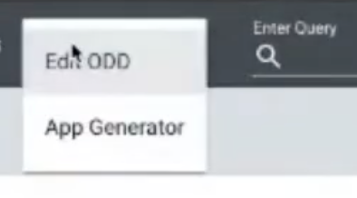

Im Formular wählt man dann das verwendete ODD aus:

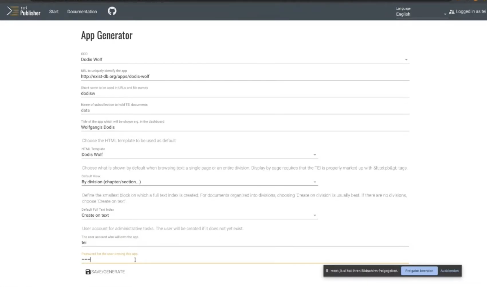

Hinweis: Der Identifier muss unique sein, die URL muss aber nicht wirklich existieren.

Als nächstes kommt man auf eine Ansicht, welche sehr ähnlich wie der TI-Publisher aussieht. Hier handelt es sich um die generierte Applikation:

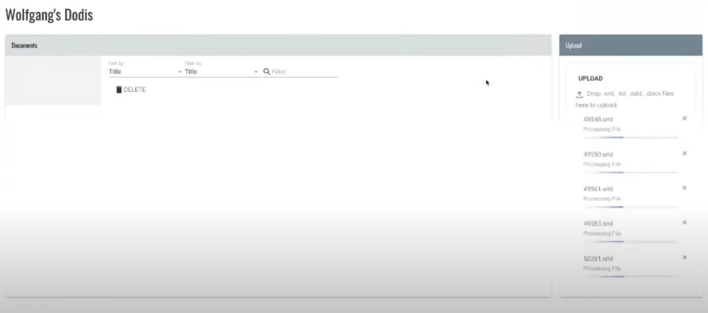

### Quellcode der generierten Applikation anpassen 

In eXide befindet sich der Quellcode der generierten Applikation. Dieser Quellcode (ODD-Dateien, .xql-Dateien, .html-Dateien) kann bearbeitet werden, um die Applikation nach den eigenen Bedürfnissen anzupassen.

Die Dateien können entweder direkt mit eXide angepasst werden, oder mit einem anderen Editor, der die Dateien zu eXide synchronisiert. (Siehe separates Dokument "Arbeiten mit TEI Publisher: GIT Workflow")


### Welche Dateien der generierten App können bearbeitet werden?

Hier ist beschrieben, für was die einzelnen Dateien stehen, wenn man eine Applikation generiert hat: [https://teipublisher.com/exist/apps/tei-publisher/doc/documentation.xml?id=appgen-code-overview](https://teipublisher.com/exist/apps/tei-publisher/doc/documentation.xml?id=appgen-code-overview)

Hier gibt es eine Liste mit Dateien, die man problemlos bearbeiten kann. Zudem ist die Bedeutung der Dateien nochmals beschrieben: [https://teipublisher.com/exist/apps/tei-publisher/doc/documentation.xml?id=customization-best-practice](https://teipublisher.com/exist/apps/tei-publisher/doc/documentation.xml?id=customization-best-practice)

> In case you'd wish to further customize the generated app it's worth to keep the changes as much separated from the generated code as possible to allow for future alignment with newer versions of the TEI Publisher. 

Hinweis: Anstatt direkt das CSS zu bearbeiten sollte man ein weiteres CSS erstellen, um das bestehende zu überschreiben (für den Fall dass es ein Update für das bestehende CSS gibt.)

### Konfiguration der generierten Applikation anpassen

Die Konfiguration befindet sich unter `modules/config.xqm`

Hier sind die einzelnen Elemente der Konfiguration beschrieben: [https://exist-db.org/exist/apps/doc/configuration](https://exist-db.org/exist/apps/doc/configuration)


## Fertige Applikation mit anderen Personen teilen oder veröffentlichen

Im Admin-Menü gibt es eine Download-Option:
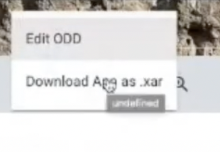

Das Projekt wird als `.xar`-Datei heruntergeladen. Dabei handelt es sich eigentlich nur um eine `.zip`-Datei mit dem ganzen Code und anderen Ressourcen. 

(Tipp: Man kann die Datei auch von `.xar` in `.zip` umbenennen und von dort entpacken)

Im Exist-Dashboard einer anderen Person (beziehungsweise auf dem Server) kann man dann einfach das `.xar`-File wieder hochladen:

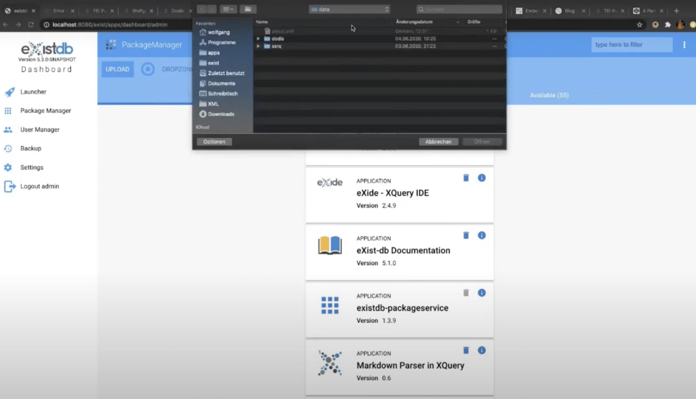
